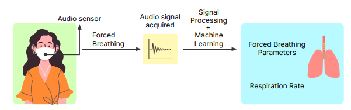

# SpiroMask

This repository introduces SpiroMask, a system that incorporates a microphone into consumer-grade masks for continuous lung health monitoring. By capturing audio signals of the user's breathing and extracting relevant features, SpiroMask enables the estimation of lung health using machine learning. It offers a low-cost, portable, and user-friendly solution for regular lung health monitoring, addressing the global need for prognoses and early detection of respiratory illnesses.

The repository is organized into four main folders:

1. **Data**: This folder contains essential raw data files for the SpiroMask project. It includes two subfolders:
   - **Ground_Truth**: This subfolder holds data related to the participants who took part in the SpiroMask project. It includes information such as age, weight, height, FEV1, FVC, PEF, lung ailments, and more.
   - **SpiroMask_Audio_Samples**: This subfolder contains audio samples collected for the SpiroMask project, which can be used for analysis and model training.

2. **Data_Visualization**: This folder provides code for visualizing the data associated with the SpiroMask project. The visualization scripts offer insights into the characteristics of the audio files. The following Jupyter Notebooks are included:
   - **Visualise_Waveforms.ipynb**: Visualizes the raw waveforms of the audio files in the time domain.
   - **Visualise_Bandpass.ipynb**: Visualizes the bandpass filtered waveforms of the audio files.
   - **Visualise_Envelope.ipynb**: Visualizes the envelope of the bandpass filtered audio files.
   - **Visualise_Audioclipping.ipynb**: Visualizes the Audioclipping of the bandpass filtered audio files, helping identify the start and end of breath.
   - **Visualise_Spectrogram.ipynb**: Visualizes the spectrogram of the audio files before and after applying the bandpass filter. Spectrograms are plotted in the frequency domain.

3. **Feature_Engineering**: This folder contains the Jupyter Notebook `Feature_Extractor.ipynb`, which provides a feature extraction pipeline specifically designed for analyzing audio data captured by the SpiroMask. The notebook facilitates the extraction of various features from the SpiroMask audio signals, enabling in-depth analysis of respiratory patterns and estimation of lung health.

4. **ML_Model**: In this folder, you'll find machine learning models implemented using the Random Forest and Multilayer Perceptron (MLP) algorithms. These models have been trained and evaluated using the Leave-One-Out Cross-Validation (LOOCV) technique. The LOOCV approach ensures robust evaluation of the models' performance. The models can be used to estimate lung health based on the provided features extracted from SpiroMask audio data.

#

Please refer to the respective folders and files for more detailed information on each aspect of the SpiroMask DIY project. Enjoy exploring and building your own SpiroMask!

#